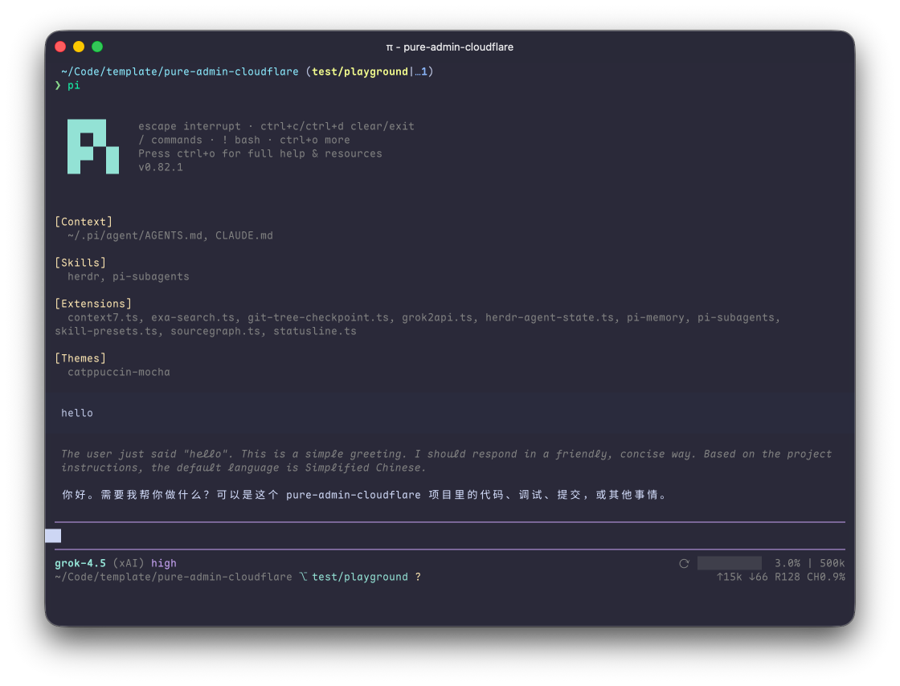

# pi-ui-catppuccin

Catppuccin Mocha theme + Claude-style statusline for [pi](https://pi.dev).

## 预览



## 安装

```bash
pi install git:github.com/whosydd/pi-ui-catppuccin
```

## 启用

安装后需手动设置主题：

```json
{
  "theme": "catppuccin-mocha"
}
```

**提示**：若不想使用本包的 statusline，可用 `pi config` 禁用 `extensions/statusline.ts` 恢复默认 header/footer。

## License

MIT
